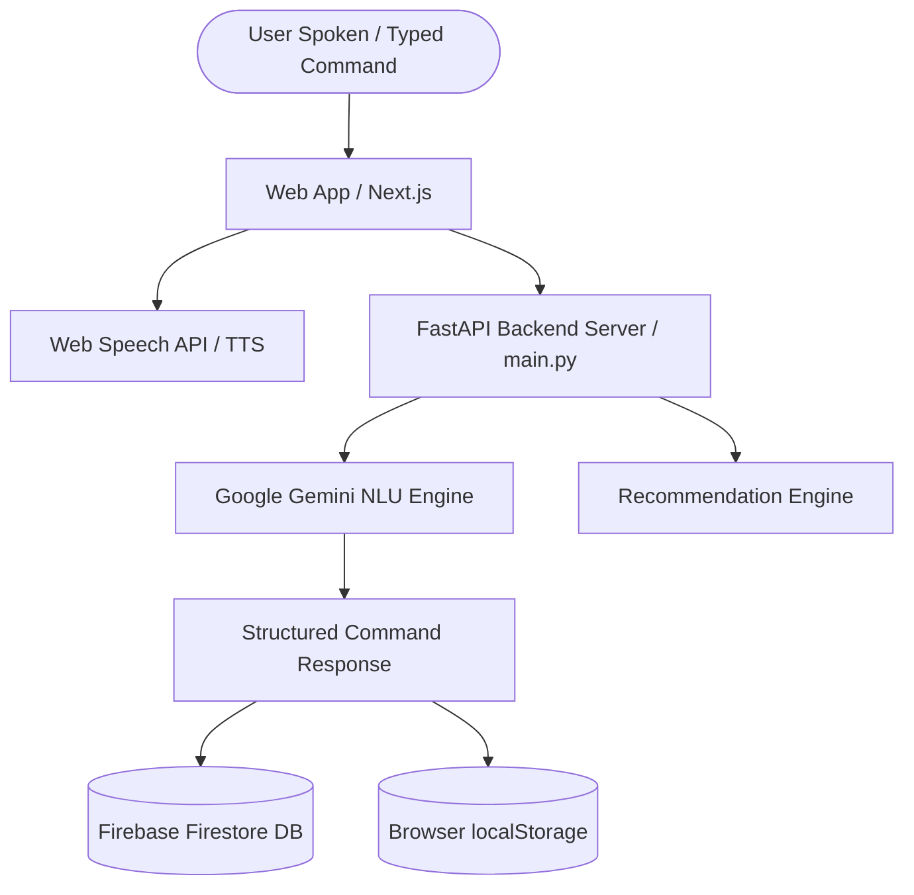

# Voice Command Shopping Assistant

A multilingual voice-activated shopping list manager with structured NLU parsing and cloud persistence.

---

## Features

- **Hands-Free Wake-Word Activation**: Say "Hello Smart Cart" to activate the microphone and send voice commands hands-free.
- **Voice Command Recognition**: Utilizes the Web Speech API for real-time speech-to-text transcription.
- **Multilingual NLU**: Supports English, Spanish, French, German, Hindi, Japanese, and Chinese.
- **Structured NLU Engine**: Uses a structured JSON schema parser to translate flexible natural language phrases into actionable structured data:
  - `add`: Insert or update items with quantities and auto-categorization.
  - `check`: Mark items as acquired.
  - `modify`: Adjust quantities or details of existing items.
  - `remove`: Delete specific items.
  - `search`: Filter items by keywords or price range.
  - `clear`: Reset the list.
- **Recommendation Engine**: Suggests low stock staples, seasonal items, dietary substitutes, and complementary pairings based on current cart contents.
- **Price Range Filtering**: Allows voice search with price constraints to automatically filter matching items.
- **State Synchronization**: Supports real-time synchronization with Firebase Firestore and local browser persistence via localStorage.
- **Text-to-Speech (TTS)**: Provides audio feedback for actions in the user's selected language.
- **Responsive User Interface**: Built with Next.js and Tailwind CSS for responsive cross-platform compatibility.

---

## Technical Architecture



---

## Installation & Setup

### Prerequisites

- Python 3.9+
- Node.js 18+ (for Next.js frontend)
- Google Gemini API Key (Set in `.env` as `GEMINI_API_KEY`)
- (Optional) Firebase Admin Credentials JSON (placed at repository root for Firestore sync)

### 1. Backend Setup

```bash
# Navigate to the backend directory
cd backend

# Create and activate virtual environment
python -m venv venv
# On Windows:
venv\Scripts\activate
# On macOS/Linux:
source venv/bin/activate

# Install dependencies
pip install -r requirements.txt

# Run the FastAPI server
uvicorn main:app --reload --host 127.0.0.1 --port 8000
```

### 2. Frontend Setup

```bash
# Open a new terminal and navigate to the frontend directory
cd frontend

# Install dependencies
npm install

# Run the Next.js development server
npm run dev
```

### 3. Environment Configuration

Create a `.env` file in the `backend` directory:

```env
GEMINI_API_KEY=your_gemini_api_key_here
```

Access the frontend application in your browser at `http://localhost:3000`.

---

## API Reference

### 1. `POST /api/parse-command`
Parses raw spoken or typed text into structured shopping commands.
- **Request Body**:
  ```json
  {
    "transcript": "Add 2 cartons of almond milk under $4",
    "language": "en-US"
  }
  ```
- **Response**:
  ```json
  {
    "action": "add",
    "item": "Almond Milk",
    "quantity": "2 cartons",
    "category": "Dairy",
    "price_max": 4.0,
    "substitute_suggestion": "Oat milk or soy milk",
    "seasonal_note": "On sale this week",
    "language": "en",
    "message": "Added 2 cartons Almond Milk to your shopping cart."
  }
  ```

### 2. `POST /api/recommendations`
Generates context-aware product recommendations based on the current cart contents.
- **Request Body**:
  ```json
  {
    "current_items": ["Coffee", "Bread"],
    "language": "en-US"
  }
  ```

### 3. `GET /api/get-list`
Fetches all shopping cart items synced with Firestore.

### 4. `PATCH /api/item/{item_name}`
Updates item parameters including checked state, quantity, and category.

### 5. `DELETE /api/item/{item_name}` & `DELETE /api/clear-list`
Deletes a single item or clears the entire shopping list.

---

## Technical Approach

The Voice Command Shopping Assistant employs a decoupled architecture using FastAPI for backend services and Next.js for the client interface. The frontend handles audio capture via the Web Speech API and manages local state, providing a responsive experience powered by Tailwind CSS.

Natural Language Understanding (NLU) is driven by Google Gemini utilizing structured JSON schema outputs. This ensures that multilingual natural language input is reliably parsed into normalized data structures for action handling, item categorization, and price extraction. The parsing engine is designed to handle speech recognition ambiguities and returns localized text for Text-to-Speech confirmation.

State management utilizes a hybrid approach, persisting data immediately to local storage while synchronizing with Firebase Firestore to ensure data availability across sessions and devices. A recommendation engine operates concurrently to analyze cart patterns and suggest relevant additions based on stock frequency, seasonality, and complementary items.

---

## License

MIT License.
